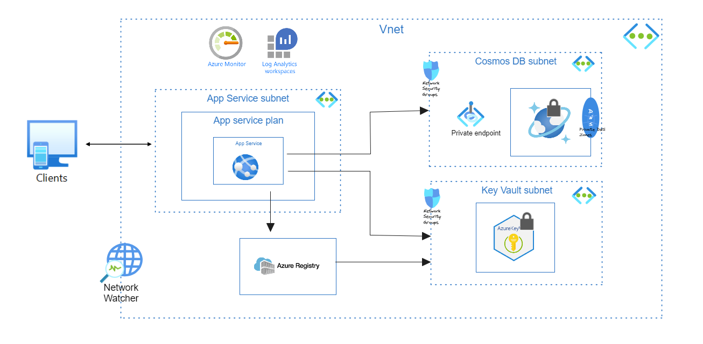

# Employee System

This project is a cloud-native employee system deployed on Azure. The system manages a list of employees and their properties. It provides an API to query the list and a UI to display it.



## Table of Contents
- [Features](#features)
- [Architecture](#architecture)
- [Technology Stack](#technology-stack)
- [Infrastructure as Code](#infrastructure-as-code)
- [Setup and Deployment](#setup-and-deployment)
- [Usage](#usage)
- [Security Considerations](#security-considerations)
- [CI/CD Pipeline](#cicd-pipeline)

## Features
- Manage a list of employees with various properties.
- Return a JSON object with the employee and its properties.
- Log all requests and responses securely.

## Architecture
The system is designed to be cloud-native with minimal maintenance requirements. It leverages Azure services to ensure scalability, security, and reliability.

### Components
- **API Service**: A Python-based API hosted on Azure App Service.
- **Database**: Azure Cosmos DB for storing employee data.
- **Networking**: Azure Virtual Network with subnets for secure communication between services.
- **Monitoring**: Application Insights for monitoring and logging.
- **Key Vault**: For secure storage of sensitive data such as connection strings.

## Technology Stack
- **Backend**: Python (FastAPI, Gunicorn)
- **Database**: Azure Cosmos DB
- **Infrastructure as Code**: Terraform
- **CI/CD**: Azure DevOps Pipeline

## Infrastructure as Code
The entire infrastructure is defined using Terraform, allowing for easy deployment and management.

## Setup and Deployment
To deploy the system, follow these steps:

1. **Clone the Repository**:
    ```sh
    git clone <repository_url>
    cd <repository_directory>
    ```

2. **Configure Terraform**:
    - Ensure you have the necessary Azure credentials set up.
    - Initialize Terraform:
      ```sh
      terraform init
      ```
    - Apply the Terraform configuration:
      ```sh
      terraform apply
      ```

3. **Deploy the API Service**:
    - The API service will be automatically deployed as part of the Terraform configuration.

4. **Configure Azure DevOps Pipeline**:
    - Set up the pipeline using the provided YAML file to enable CI/CD.

## Usage
To query the API, send a GET request to the API endpoint with the desired criteria. Example:

```sh
curl -X GET "https://<your_api_endpoint>/employees"
```

## Security Considerations

All sensitive data such as connection strings are stored in Azure Key Vault.
Network security groups and private endpoints are used to secure communication between services.
Logging and monitoring are enabled through Application Insights.


## CI/CD Pipeline

The CI/CD pipeline is configured using Azure DevOps. Any code change triggers the pipeline to deploy the updated code to Azure.

Feel free to modify the content according to your specific project details and requirements.
